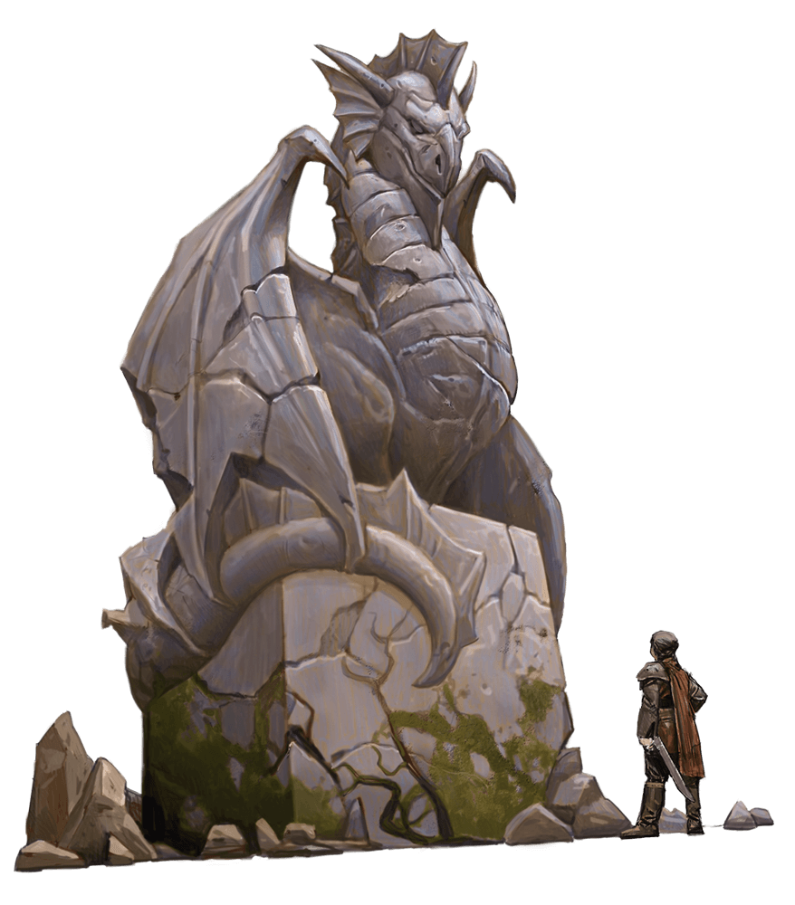
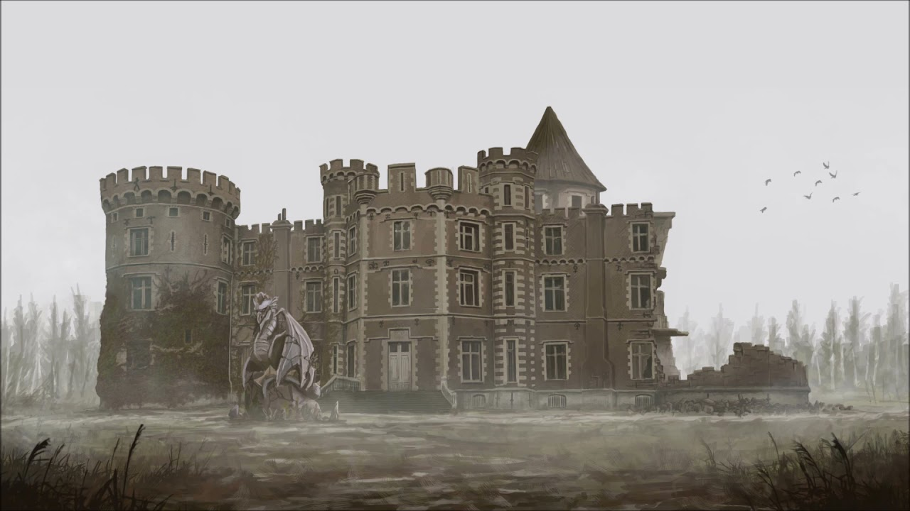

# Argynvostholt

## Overview

### Lord Argynvost

- A silver dragon
- Was wealthy disguised as a nobleman
- Used his walth to bring paladins and lords to join his Order
- He built Argynvostholt to watch over the Amber Temple
- Found the Order of the Silver Dragon
- Initially was victories but they couldn't win the war against Strahd
  - Even with the dragon
  - After his death, he was ripped apart and transported to the Castle Ravenloft as a trophy
- After the drangon's death, Argynvostholt become as haunted ruin

### The Order of the Silver Dragon

- The death of Argynvost enraged a spirit
  - Vladimir Horngaard, greatest knight
  - Sworn to avenge the destruction of the order
  - He returned back as a revenant
  - The zeal brought back some other knight also as revenants
- The revenants killed a lot of men of Strahd
  - But they were outnumbered
  - War though months
- When Strahd dies (and become vampire) the souls cannot leave the domain
  - They marched to the Castle
  - Madam Eva said them he also trapped, and will be tourtured because of the Death of Tatyan and the his brother Sergei
- Vladimir they went back to Argynvostholt
  - They are killing Strahd agents
  - Consumed by hatred, and lost their honor and nobility
- Argynvost isn't resting also
  - His soul is corrupted
  - If the players get back the dragons's skull from the Castle and bring back to the mausoleum of Argynvostholt
    - The spirit of the dragon goes up to the highest tower and transforms into a beacon of the light that flashes across Barovia
    - It reminds Vladimir Horggrand what he has lost and he and his knights find redemption and rest

### Approching

> Magasan a folyó völgye fölött egy csendes hegyfok nyúlik ki, amelyen egy sírkastély húzódik, tornyait mesebeli kúpok fedik, tornyait faragott ormák szegélyezik. A szerkezet harmada összeomlott, akárcsak a tető egy része, de a többi épnek tűnik. Sötét, nyolcszögletű torony magasodik a környező építészet fölé.
> A ködből távoli mennydörgés hallatszik, amit gyorsan kísér a farkasok üvöltése a lenti erdőben, de a ház csendben áll, mintha valami régen meghalt valami megkövesedett maradványai csapódtak volna le a hegyoldalon.

## Ground Floor

%20(Medium).jpg>)

### Q1 - Dragon Statue

> Egy tíz láb széles, tíz láb magas gránitkocka tetején egy mohával borított sárkányszobor áll, szárnyait a testéhez szorítva. A szobor keletre néz, a kastély felé.

- The fog makes it hard to see the features
- Close inspection
  - Solver dragon of noble bearing
  - Cracked and broken many places
  - 10 feet tall
  - From granite
- Detect magic
  - Radiated aure of evocation masgic
  - Used breathe cone of cold, part of magic trap
  - Does not work

### Q2 - Main Entrance

> A kőkorlátokkal szegélyezett kőlépcsők felmásznak egy lépcsőfokra egy pár magas, faajtó előtt, rozsdás vaspántokkal és kis sárkányok alakú kopogtatókkal. A bejárat feletti szemöldökbe vésve az ARGYNVOSTHOLT szó.

- If the characters climbs on the landing
  - The statue (Q1) exhales a 60 foot cone of harmless cold air and closes its mouth
  - Does not active until the next dawn
- The door is unlocked

### Q3 - Dragon's Foyer

> Ez a szoba olyan, mint egy királysír. Nagy lépcső vezet fel a kőerkélyekre, amelyeket kőoszlopok és boltívek tartanak a magasba. A lépcsőfeljáró fölött egy vasrúdról egy ezüstpáncélos nemest ábrázoló magas, kifakult kárpit lóg.
> Ebből az előcsarnokból hat készlet dupla ajtó vezet. A falak mentén, márvány talapzaton, három alabástrom mellszobra, jóképű férfiakkal. A negyedik mellszobrot és talapzatát kidöntötték, összetört maradványaik pedig szétszórva hevernek a mozaikpadlón. Két kovácsoltvas csillár lóg a mennyezetről, mint szörnyű fekete pókok.

- Tapestry is torn and worthless
- Portrait of Lord Argynvost
- Stairs leads to Q18

- First time:

> Egy hatalmas, szárnyas árnyék halad át a falakon, és eltűnik. Hallod a halk állati sziszegést a sötétben.

- Shadow is harmless

### Q4 - Spiders' Ballroom

> A hatalmas kamra nagy részén törmelék szóródik, amit a fölötte lévő szobák részleges összeomlása okoz. A rózsaszín márványpadlón ledőlt csillárok hevernek törött székek és egyéb bútorok között. Vastag hálók húzódnak faltól falig, és túl sok óriási pók mozog közöttük ahhoz, hogy megszámoljuk!

- 9 giant spiders nest
  - They attacks any body who gets close

### Q5 - Ruined Stable

> Itt fekszenek egy fából készült istálló megfeketedett gerendái, kőalapjáig leégve. A roncsok felett kirajzolódik a kastély részben összeomlott déli vége, mindhárom emelete ki van téve az időjárás viszontagságainak.

- Nothing here

### Q6 - Dragon's Den

> Ezt a faburkolatú barlangot feldúlták, berendezését feldobták. Hideg, sötét kandalló uralja a nyugati falat két keskeny ablak között. Az északi fal mellett függőlegesen áll egy fekete fából készült szarkofág, amelynek fedelébe királynői alakot véstek.

- Argynvost's empty sarcophagus
  - Convert to wine cabinet
  - Shatterd glasses
- Rotted divans, borken chairs, smashed lamps
- Secret door to Q11

- If the fire is not lit yet:

> A halott kandallóban tűz csap ki, és drákói formát ölt. Sziszeg, recseg, és kibontja füstös szárnyait.

- Roll Initiative
  - The fire has 10
  - The fire's AC is 15 and has 1 HP
    - If reduced to 0 HP
      - Explodes in the room
      - DC 12 Dexterity saving throw
        - 4d10 fire damage - on failed
        - Hald - on success
  - In the fire's turn
    - Doesn't attack
    - Read:

> A tüzes sárkány sziszegve szólít meg. "A lovagjaim a sötétségbe zuhantak. Mentsd meg őket, ha tudod. Mutasd meg nekik a fényt, amit elveszítettek!" Ezzel kialszik a tűz.

- Refers to the beacon

### Q7 - Parlor

> A szalont körülvevő magas, karcsú ablakokat rongyos bársonyfüggöny borítja. A berendezési tárgyakat por és pókháló borítja, és összevissza hevernek. A mennyezetről egy sérült sárgaréz csillár lóg, amelyet egy kifakult falfestmény borít, amely fémes sárkányokat és színes madarakat ábrázol, akik fehér felhők alatt repülnek.

- Nothing value

### Q8 - Iron Gate

- Chained shut
- Key lost
- Can be lock picked
  - DC 20 Decterity check with thieves tools
  - DC 15 Strength check - with weapon
- Acces to Q7 and Q9

### Q9 - Servents' Quarters

> A kör alakú szoba ablakait rongyos, barna drapériák takarják, a déli boltíven pedig nehéz függöny lóg. A padlón fél tucat ágy és egyéb bútorok roncsai hevernek.

- Curtain lies the kitchen (Q10)
- THe palce of the household staff
- Nothin value

### Q10 - Kitchen

> Ezt a konyhát kifosztották, az asztalait felborították. A padlót rozsdás edények és összetört edények borítják. A kandalló melletti keskeny ablakok a temetőre néznek. A megfeketedett kandalló belsejében egy horogról nyitott vasfazék lóg. Zörög a horgán, és fel-le billeg, mintha valami lenne benne.

- Iron pots contains an ordinary bat
- When the characters are close, it flew out

### Q11 - Wine Storage

> Öt hordó hever fa merevítőkben ennek a sötét, penészes raktárnak a falai mentén.

- Behind the barrels
  - Wounded elf - Savid - dusk elf scout
    - Has 4 HP (14 HP - updated)
  - He search the Arrabelle
  - A mob of needle blights attacked him
  - He had to shelterd himself here
  - Infos what he knows:
    - Argynvost was a silver dragon, he used human form
    - Argynvostholt is his home
    - In human guise, lead a noble group of knights
      - Order of the Silver Dragon
      - They gave shelter who needed
    - Strahd's army killed the dragon and destructed the order
    - They thinks (Vistani) the dragon's soul is here
- The wine in the barrels are rotted
  - Wizard of Wines
  - Champagne du le Stomp
- Secret door to Q6

### Q12 - Dining Hall

> A terem közepén egy húsz láb hosszú asztal áll faragott sárkányokkal. Az asztalt körülvevő székek hátát összehajtott sárkányszárnyakra faragták, és több szék felborult vagy darabokra tört. Az asztal fölött egy kristálycsillár van felfüggesztve, amely lágy fehér fénnyel világít. Az ablakos fülkékben két életnagyságú szobor áll, amelyek sárkányszárnyú sisakos és pajzsos lovagokat ábrázolnak.
> Az esővíz átszivárog a mennyezet repedésein, lefolyik a nyugati falon, és egy nagy tócsát hoz létre a padlón.
> Öt készlet faajtó vezet ebbe a terembe. Az északkeleti sarokban az ajtók nyitva lógnak. A keleti falba állított ólomüveg panelek között egy pár ólmozott üvegajtó, repedt és betört ablaktáblái nyitva állnak. Ezek a táblák ezüst sárkányokat ábrázolnak repülés közben. Az üvegajtókon túl egy sötét, ködös szoba terül el, amely kápolnának tűnik.

- Continual light spell on the crystal chandelier
  - Never dispelled
- Knight statues are lifelike but inanimated

### Q13 - Chapel of Morning

> A repedezett faoszlopok egy fából készült, U-alakú erkélyt támasztanak alá, amely túlnyúlik ezen a kőfalú kápolnán. Keskeny boltívek vezetnek az erkélyre felcsavarodott csigalépcsőkhöz, az északi falba állított ajtót pedig fagerendás zárja el. A kápolna keleti végén egy kőoltár áll, amelyet vas kandeláberek szegélyeznek. Az oltáron felkelő nap domborműve van kifaragva. Magas, íves ablakok ólomüveg panelekkel díszítik az oltár mögötti falakat. Az egyik ablak betört, színes üvegszilánkokkal borította be a kápolna padlóját, és sűrű köd tud behatolni a helyiségbe.

- If the beacon is not lit

> A ködön át három páncélos alakot látsz az oltár előtt térdelni.

- 3 revenants
  - They wield longsword
  - Tattered chain mail
  - If the beacon is lit: the revenants are cleanesd and the characters find 3 armored corpses with longsword
  - They attack on sight
    - Drive the characters out of the fort
  - As an action the revenants attack twice with longsword (2 hand)
- DC 10 Religion
  - From icongraphy and orientation: the chapel is dedicated to a god of the dawn
  - Who knows the Barovian religions: Morninglord
- Balcony: Q24
  - Can climb (20 ft)
- Spiral staircase Q14
- Door to Q15
  - Bar
  - Can be removed easily by lift

### Q14 - Chapel Staircases

> A keskeny ablakok lehetővé teszik a gyenge fény bejutását ebbe az öt méter széles csigalépcsőbe.

- Leads to Q24

### Q15 - Cemetery

> A kastély mögött egy ködbe burkolózott temető húzódik meg, amelyet hét méter magas kovácsoltvas kerítés vesz körül. Az északkeleti sarokban mauzóleum áll.

- If the beacons is not lit

> Hirtelen úgy érzed, hogy valaki vagy valami figyel téged. Felnézve egy jól öltözött, bogáncsos hajú férfit látunk, aki egy magas toronyablakból figyel rád. Elhúzza a függönyt, és eltűnik a szem elől.

- Strange man is watching from Q42
- 5 graves have been dug up
  - DC 10 Perception
    - The corpses crawled out of the earth
    - No sign
    - The fence untouched (no outside)
- Stone stairs to Q13

### Q16 - Dragon's Mausoleum

> A mauzóleum kőcserepes tetején elmosódott, ezüstözött vízköpők tapadnak sárkányörvényekre. A délnyugati falba állított nyolc láb magas, négy méter széles fehér márványajtón egy ARGYNVOST név van gravírozva.

- The gargoyles are harmless
- Stone door
  - DC 15 Strength

> A mauzóleum belseje sötét és poros. Négy üres fülkét lát, emelt padlóval. A túlsó falba egy drákói nyelven írt vers van bevésve.

- Draconic script:
  - Here lie the bones and treasures of Argynvost, lord of Argynvostholt and founder of the Order of the Silver Dragon
- If the skull of the dragon are brought back here: The beacon will be lit

## First Floor

%20(Medium).jpg>)

### Q17 - West Staircases

> Keskeny ablakok világítják meg ezt a poros, öt méter széles csigalépcsőt.

- Connect Q18 to Q30 and Q36

### Q18 - Balconies

> A fő előteret két kőből készült erkély határolja. A csillogó páncélos lovagokra faragott korlátok támasztják alá elegánsan faragott kőkorlátaikat. Fegyverek és pajzsok díszítik a falakat mindegyik sétány mentén, míg jóképű férfiak alabástrom mellszobra szegélyezi az előcsarnoktól északra és délre vezető folyosókat. Minden erkély nyugati végén egy boltív található, amely egy csigalépcsőhöz vezet felfelé.

- The weapons and shields are non-magicals

### Q19 - Ruined Bedchambers

> Ennek a helyiségnek a déli vége összeomlott, kitéve a kamrát az elemek hatásának. Néhány berendezési tárgy összetörve hever a fenti szintről lehullott törmelék alatt.

- The wooden floor creaks under step
- Its safe, but spiders from Q4 crawl up and attack
- 20 feet abover the floor of the ballroom

### Q20 - South Alcove

> A csarnok délkeleti sarkában található fülke előtt vörös bársonyfüggöny lóg. Olyan enyhén hullámzik.

- If the characters look behind the curtain:

> Fekete ruha takar valamit egy fehér márvány talapzaton.

- Severed head of an random characters under the black cloth
  - Strong illusion
  - Cannot misbelieve
  - Can dispell
- Originally is a handsome, middle-aged human with trimmed mustached and beard (Lord Argynvost)

### Q21 - North Alcove

> A csarnok északkeleti sarkában található fülke előtt vörös bársonyfüggöny lóg.

- Alcove is empty
  - The curtain is closes until the characters is coming back
    - Expect: The characters remove the curtain from the rod

### Q22 - Bathroom

> A szobában vaskád található, a falakon pedig faburkolat található, amely három láb magasra emelkedik. A burkolat felett a falakat egybefüggő, halvány hegyi tájkép falfestménye festette.

- Balinok Mountains

### Q23 - Storage Room

> Az esővíz átszivárog a mennyezet repedésein, és a megereszkedett fapadlón egy medencébe folyik. A medence körülbelül a szoba felét kitölti. A falakon csupasz kőpolcok sorakoznak.

- Looted room
- The floor cannot support more than 100 pounds
  - It collapse and the players fall to the Q12 (20 ft)

### Q24 - Chapel Balcony

> Ez a fából készült erkély a kastély kápolnáján túlnyúlik. A nyugati végén, két ajtó között egy gyönyörűen faragott fából készült trónus nyugszik, és keskeny boltívek vezetnek fel-le csigalépcsőkhöz. A magas mennyezetről egy vascsillár lóg, apró ezüstsárkányok alakú gyertyatartókkal.

- Doors lead to Q20 and Q21
- Above the chapel (Q13)

### Q25 - Trapped Hallway

> Ennek a T-alakú folyosónak nyugati, keleti és déli ágai vannak. Az északi fal három boltíves ablaka a ködös talajra néz.

- 20 feet high
- Doors are locked and lead to Q27 and Q28
  - DC 20 Strength
  - the 5 feet square before the doors are trapped
    - 7 phantom warriors rush from Q27 (4) and Q28 (3)
    - A wall of stone appear from floor to ceiling on the south wall
      - The wall vanish after 10 minutes
      - The trap resets after 10 minutes
  - Detect magic
    - can percieve hazy auras of evocation magic on front of the doors

### Q26 - Northeast Guest Room

> Két, szakadt baldachinos ágy áll a szemközti falak mellett, köztük egy kopott szőnyeg hever a padlón. A túlsó falban egy koromfekete kandalló található. Halk sziszegés hallatszik a kandallóból.

- One or more characters within 10 feet of the fireplace:

> Hamuból és füstből készült kis, sziszegő sárkány tör elő a kandallóból, és szárnyait verve megtölti a szobát kormmal.

- Stats: smoke mephit
  - Only self defense
- If left alone
  - He flyies to Q17 -> Q30 -> Q33 -> Q36 (30 ft flying speed)
  - Lands on the back of the throne and disappears

### Q27 - Knights' Quarters

> Ez a szoba tele van régi emeletes ágyak roncsaival. Öt koszos ablakon kevés fény jut be, köztük négy üres páncélállvány. Üres fáklyalámpák sorakoznak a falakon.

- 4 phantom warriors haunt
  - They manifest when a player enters the room or trigger the magic trap in Q25

### Q28 - Knights' Quarters

> Ennek a kör alakú helyiségnek az ablakait rongyos és kifakult függönyök borítják, a falakon üres fáklyák sorakoznak. Törött emeletes ágyak és páncélállványok hevernek a padlón.

- 3 phantom warriors haunt
  - They manifest when a player enters the room or trigger the magic trap in Q25

#### Q28 - Treasure

- Under the wreckage
  - Small wooder coffer
    - 4 potions of invulnerability
- Need to search to room

### Q29 - Northwest Guest Room

> Ennek a helyiségnek a tartalma pókhálókba borítva. A függönyös ablakok között fekete márvány kandalló áll faragott kandallópárkányon, fölötte egy jóképű, jólöltözött, fanyar mosolyú, sűrű bogáncshajú férfi bekeretezett portréja lóg. A kandallóval szemben egy nagy ágy, rothadó matraccal és sárkányokra faragott faoszlopokkal. A dupla ajtóval szemben egy magas gardrób áll, az ajtaja nyitva lóg, és egy sötét és üres üreget tár fel. Az egyetlen másik bútor egy túltömött bőrszék, amely a kandalló felé néz.

- Portrait of the silver dragon in guise - human noble Lord Argynvost

## Second Floor

%20(Medium).jpg>)

### Q30 - Curtained Staircase

- Spiral staircase
  - Descends to Q17
- Secret door to Q36

### Q31 - East Staircases

- They connects the third floor and the roof

### Q32 - Ruined Bedchambers

> Ennek a kamrának a nagy része összeomlott. A fapadlót törmelék borítja, és délen egy ködös szakadékba zuhan. A tető szaggatott és törött.

### Q33 - Collapsed Ceiling

> A kastély ezen része fölött beomlott a tető, és egy húsz méter átmérőjű, tátongó lyuk keletkezett, amelyet törött szarufák kettészeltek. Sötét viharfelhők gördülnek át az égen a fejünk felett. A padló tele van kövekkel, törött csempével, összetört gerendákkal és egyéb törmelékkel. A törmelék alatt megereszkedett padló és esővíz tócsák hevernek.

- 20 feet high
- Difficult area (rubble)
- Vladimir Horngaard can hear the visitors who climbing over the rubble and can't be surprised

### Q34 - Ruined Bathroom

> Ez a szoba csempézett padlóval és vaskáddal rendelkezik, amely tele van a beomlott tetőről származó törmelékkel. A keleti fal közepén egy nyitott ajtóban egy szakadt függöny lóg.

### Q35 - Upstairs Gallery

> Ennek a szobának a falai sötét faburkolattal rendelkeznek, amely három láb magasra emelkedik. A burkolat felett a falakat szent szertartásokat végző vallási alakok falfestményei festették. A nyugati fal közepén egy rongyos függöny lóg egy nyitott ajtóban. A szemközti falba három magas, karcsú ólomüveg ablak fehér köpenyes alakokat ábrázol, fejük mögött narancssárga napfelkeltével.

- 3 stained glass windows
- 2 portrays:
  - Saint Andral, the Morninglord
  - Saint Markovia

### Q36 - Dragon's Audience Hall

> Ennek az ötven méter hosszú, harminc méter széles közönségteremnek a nyugati fala leomlott, tátongó lyukat és törmelékkupacot hagyva maga után. A falakon egykor lógó fegyverek és pajzsok a padlóra estek és rozsdásodtak. Egy nagy, fából faragott trón, amely kitáruló szárnyú sárkányra hasonlít, három magas ablakra néz nyugatra. A trónban egy sovány, páncélozott alak ül, egy kesztyűvel egy nagy kard markolatára.

#### Vladimir Horngaard

- Commander of the fallend Order of the Silver Dragon
- In the throne
- If the beacon lit: the corpse is lifeless
- If the beacon isn't lit
  - The body is host for a revenant
  - He says: "Go away"
  - If the characters don't leave:

> A lény szorítása megfeszül a nagykardon. "Ha azért jöttél, hogy elpusztíts, tudd meg: több mint négy évszázaddal ezelőtt elpusztultam, amikor megvédtem ezt a földet a gonosztól, és kudarcom miatt örökre el vagyok ítélve. Ha elpusztítod ezt a testet, szellemem új holttestet fog találni. , és levadászlak. Nem szabadíthatsz meg a kárhozatomtól, és nem is kívánom.
> "Ha azért jöttél, hogy megszabadítsd ezt a földet az ártatlanok vérén lakmározó teremtménytől, tudd meg: nincs olyan szörny, amelyet jobban gyűlölök Strahd von Zarovichnál. Megölte Argynvost, megtörte a lovag életét, akit szerettem, és lerombolta a vitéz rendet, aminek az életemet szenteltem, de Strahd már egyszer meghalt. Nem hagyhatják, hogy újra meghaljon. Ehelyett örökké szenvednie kell a saját teremtménye poklában, ahonnan soha nem menekülhet. megtehetem, hogy nyomorúságot és nyugtalanságot okozzon neki, megteszem, de elpusztítok mindenkit, aki megpróbál véget vetni kínjainak."

- He fights in self-defense
- He fights if the characters press for help destroying Strahd
- If Vladimir takes damage
  - 6 phantom warriors appears and help
- Hatred:
  - He does not remembers to Sir Godfrey
  - If Godfrey helps to defeat Vladimir
    - angished recognition shines in Vladimir's eyes

#### Q36 - Treasure

- +2 greatsword
- Platinum holy symbol (250 gp) of the Morninglord
  - Around neck, under armour

### Q37 - Knights of the Order

> A poron és pókhálókon át kifakult háborús transzparensek díszelegnek egy tágas kamra falán, amelynek közepén egy nehéz faasztal áll. Az asztal fölött egy vascsillár lóg, amelyet hat magas támlájú szék vesz körül, amelyek tetején fából faragott sárkányok ülnek. A székek közül ötben csontvázas emberek roskadoznak rongyos láncpántban.

- Room for the leaders
- If the beacon is not lit:

> I A holttestek feléd döntik a fejüket. Egyikük felhördül: "Miért zavarjátok az élők a holtakat?"

- 5 revenants
  - lawful evil
  - fights in self-defense
  - they have chainmail and longsword
  - when attack: they attack twice with the sword (2d19 + 4 slasing damage)
- 1 revenant is Sir Godfrey Gwilym
  - He is a spellcaster
  - 16th spellcaster
  - spell-casting ability: Wisdom (spell save DC 15)
  - paladin spells:
    - 1st (4 slots): command, detect magic, divine favor, thunderous smite
    - 2nd (3 slots): aid, branding smite, magic weapon
    - 3rd (3 slots): blinding smite, dispel magic, remove curse
    - 4th (2 slots): aura of purity, staggering smite
- Shield-shaped patch on the wall
  - The shield is missing
  - It is in the Castle Ravenloft treasure
- If the characters tries to speak and ask help
  - Godfrey asnwer to them
  - He have all the information from the first chapter about Argynvostholt
  - They can't help them, because of the oaht to Vladimir Horngaard

### Q38 - Closet

> Ennek a poros szekrénynek egy karcsú ablaka van az északi falban. A szoba egyébként üres.

### Q39 - Vladimir's Bedroom

> Ebbe a kör alakú szobába öt repedezett ablakon keresztül jut be a fény. A fény egy nagy, porral borított ágyra esik a szoba közepén, oszlopai tetején fából faragott sárkányok. Két nagy állat szegélyezi a dupla ajtót. Az egyik egy barnamedve, aki a hátsó lábain áll, karmai kinyújtva. A másik egy szörnyű farkas, az arca gonosz vicsorgásba fagyott. A farkas közelében egy üres faláda fekszik.

- This was the room of Sir Vladimir Horngaard and Sio Godfrey Gwilyn
- Are items are harmless
- The chests are empty

### Q40 - Argynvost's Study

> Ez a szoba a por és a pókháló menedéke. A három keskeny ablakon fényfoszlányok világítanak meg a falak mentén elhelyezkedő csupasz tölgyfa polcokon és egy szakadt, párnázott széken, amely az oldalán hever egy barlangos kandalló közelében. A kandalló fölötti kép le van vágva, alsó fele a keret alatt lógott le, mint egy szakadt húsdarab. A nyugati fal déli sarkában található vasajtó az egyik zsanéron lóg nyitva.

- The door of the vault (Q41) was sealed but it is breached
- The books are taken
- A book remained
  - It burnt and the covered is slahed by a sword
  - Title: The Oath Celestial
  - Book reveals a devotional text for knights from a place called the Holy Empire of Valentia
    - The most knight came from there to here to fight against Strahd
- Who cross the room:

> Hallod a szárnyak halk csapkodó hangját, de nem tudod felismerni az eredetét. Egyetlen darab pergamen leszáll a könyvespolc tetejéről, lustán spirál a levegőben, és finoman a lábadhoz landol.

- Last page of Argynvost's journal (rest is destroyed) - Appendix F

- Who studies the whole picture

> A képen a kastély szebb napokban látható, tiszta téli égbolt alatt, a háttérben hófödte hegyekkel. A kápolna tornya teteje ezüst jelzőfényként világít.

- Aura of transmutation on the pictire: detect magic can detect
- Aura is weak
- If they use mending:

> A képen látható jeladó ragyogó ezüst fénnyel villog, és egy hatalmas ezüst sárkány spektrális formája tölti be a helyiséget. "A koponyám ellenségem erődjében hever" - írja - "rossz előjelű helyen. Tegye vissza koponyámat a jogos kriptájába, és szellemem örökké itt fog ragyogni, reményt hozva erre a sötét földre." Ezzel a sárkány jelenése elhalványul.

- Spell-like effetct, not the spirit of the dragon
- After the speak the pciture no longer glows and becomes nonmagical

### Q41 - Dragon's Vault

- Iron door (breached)

> Ennek a helyiségnek a falai ólommal vannak bélelve. Kiürült ládák és összetört vázák hevernek a padlón, tartalmuk kifosztott.

- This vaule once held a dragon's trove. Looted.

### Q42 - Argynvost's Bedroom

> Az idő és az elhanyagolás által kifakult, gazdag drapériák takarják ennek az egyébként üres helyiségnek az ablakait.

- There is no furniture here (Argynvost prefered the sleep in dragon form)

## Roof

%20(Medium).jpg>)

### Q43 - Hole in Roof

- 20 feet diameter hole in the roof
- The rubble of the roof is difficult terrain
- Climbing on the roof
  - DC 10 Athletics
  - Failure: by 5 or more: the characters slide down, will be prone, not cause damage

### Q44 - Dragon Gargoyle

> A tetőn, a mellvédre néző, ezüstözött vízköpő ül, amely egy sárkányhoz hasonlít.

- Has magic mouth spell cast on it
- When the characters passes in front of it, the spell activated
  - Wyrmling whispers:

> When the dragon dreams its dream
> Within its rightful tomb,
> The light ofArgynvost will beam
> And rid this land of gloom.

### Q45 - Ancient Ballista

> A torony tetején egy ősi ballista áll, amelyet az idő és az időjárás korhadt meg.

- It falls apart if disturbed

### Q46 - Destroyed Ballista

> A tető tetején a kastély eleje felé egy ballista roncsai hevernek. A roncsokat két kőtorony szegélyezi kúpos tetővel és keskeny ajtókkal.

- The turrets are described in Q47

### Q47 - Roof Turrets

> Ennek a toronynak a szarufáiról pókhálók lógnak, amely egy fapad és egy vaskályha kivételével üres. Nyílrések néznek le a kastély előtti ködös területre.

- The guards used these turrets for warmth and shelter on rainy days and cold knights

### Q48 - Roof's Edge

> Egy rongyos kőszélen túl hatvan méteres zuhanás van alatta a törmelékekkel felszórt földbe. Néhány szarufa kilóg a kő alól.

- Edge is sturdy (walkable - no danger)
- 20 feet down to Q32
- 40 feet down to Q19
- 60 feet down to Q4

### Q49 - Beacon Tower Door

> A mellvéd tíz láb szélesre szűkül, és a keleti torony falába épített, erős faajtó előtt végződik.

- The door is barred from inside
- The phantom warriors in the tower's turrets (Q52) make ranged attack who tries to get in the tower
  - They have 3/4 cover nehind the arrow slits

### Q50 - Beacon, Lower Landing

> A torony falaihoz rozoga falépcső és lépcső tapad. A lépcsők egy másik lépcsőfokba vezetnek, amely húsz láb magasan van, és a kápolna padlója hatvan lábbal lejjebb fekszik.

- The landing and the stairs are creak but safe

## Beacon - Upper Landing

%20(Medium).jpg>)

### Q51 - Beacon, Upper Landing

> Csikorgó lépcsők másznak fel egy falépcsőre, amelynek három ablaka a kastély tetejére néz. Az ablakok mellett két keskeny faajtó található.

- Similar to Q50 but not safe
- Collapse under 50 or more pounds
  - DC 15 Dexterity saving throw
  - or fall 2- feet to Q50

### Q52 - Beacon Turrets

> Ennek a toronynak a tetejét kőfal veszi körül. Az alsó szintre csigalépcső ereszkedik le.

- Phantom warrior in each post
  - With spectral longbows (has longsword also)
  - Multiattack
  - Spectral Longbow: Ranged weapon attack: +2 to hit, range 150/600, one target, 1d8 force damage

## Beacon

%20(Medium).jpg>)

### Q53 - Beacon of Argynvostholt

> A kőpadlós torony csúcsára falépcsők mennek fel, melynek tetője harminc méter magas. A hollók keresztező szarufákon tanyáznak, jönnek-mennek a tetőn lévő kis lyukakon keresztül. Tíz láb magas, öt méter széles boltíves ablakok egyenletesen helyezkednek el a falak körül. Minden ablak egy ólomrácsból áll, amelyet kis átlátszó üvegtáblák díszítenek.

- The ravens are harmless, but they watch the characters
- Who watches out the window:

> Északon és keleten egy ködbe burkolt völgy terül el sötét erdőkkel, egy kisvárossal és egy magányos szélmalommal egy szakadékon. Délen egy ködös mocsaron folyó folyik át. Nyugaton, sziklás dombok között, megpillantasz egy apátságot, amely egy havas hegyoldalon ácsorog a ködbe fojtott fenyők hosszú szakaszán.

- Small town is Vallaki
- The windmill is the Old Bongrinder
- The abbey is the Abbey of Saint Markovia

#### Lighning the Beacon

- When the skull is placed into the maosoleum
  - The dragons spirist transforms into a brilliant light (fills the room and flashing)
  - Beacon of the lighthouse
- If the tower is destroyed, the light remains
- Can't reach the castle, but Strahd sees it
- Can be seen from: Vallaki, Krezk, Berez, Old Bonegrinder, Van Richten's Tower, Werewolf den
- The light can be felt, also for blinds

##### Beacon of Protection

- Creatures against Strahd gains +1 Bonus AC and Saving throws in Barovia

##### Revenants at Rest

- Vladimir Horngaard and the others sees the light, and rest in peace

## Special Events

### Special Delivery

- Inside Argynvostholt
- Passive Perception of 11
  - Hears horse hooves and wheels of a wagon
- Cart pulled by a draft horse
  - Mad vistana = Kolya (bandit)
    - Relieve itself to the statue and leave the cart and the cargo before the mansion
    - He rides back to the Vistani camp (N9)
  - Cargo : Coffin
    - Made by Henrik van der Voort
    - It has the name of one of the characters
    - Opening the coffin releases a swarm of bats
    - The swarm attack the characters whose name is craved in the coffin

### Arrigal's Hunt

- Ezmerelda d'Avenir arrives on horse (stolen from the Vistani camp)
- She cames for secrets about Strahd (for the destruction)
- When she arrives, she releases the horse
  - She goes into the mansion and silently reaches the characters
- After the trail of Ezmerelda
  - Arrigal (assassin) and two Vistani bodyguards (bandits) are coming
  - Arrigal comes with black horse, the bodyguards with dire wolves
  - The dire wolves are servants of Strahd and cannot be charmed or frightened
  - They want to capture Ezmerelda and bring back to the camp for punishment for the theft
  - If the characters does not give up Ezmerelda (wont try asking), goes back to the camp
