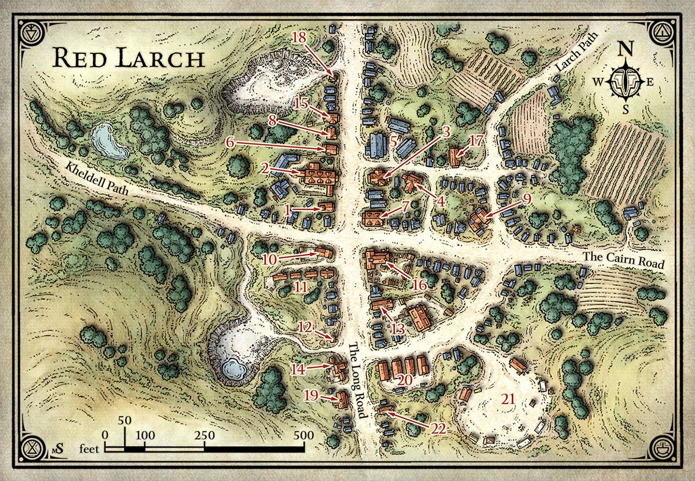
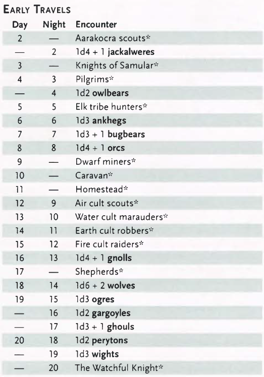
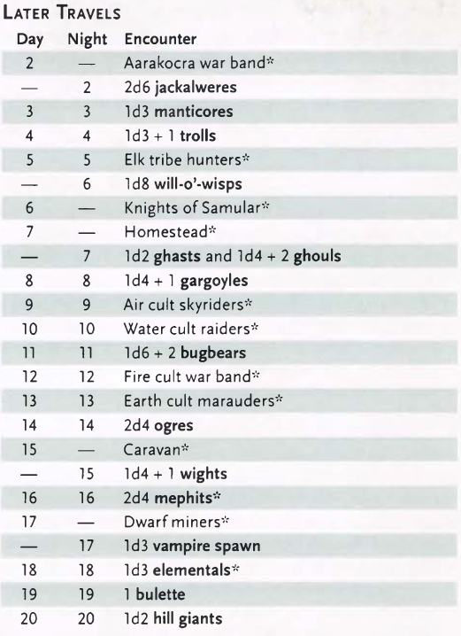
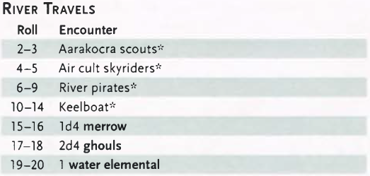
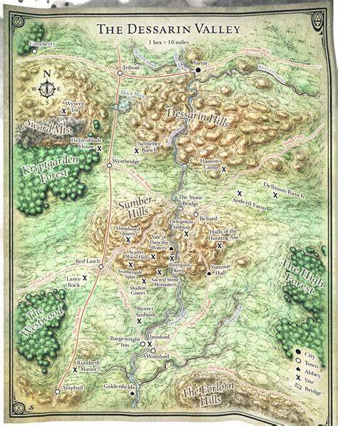

# Dessarin Valley

- Just a week's journey from Waterdeep
- Nothing a note happened here
- Winters are hard, but the hungry orcs and monsters are far away from here
- Main places: **Red Larch**, **Triboar**
  - Hundreds of caravans and keelboats are passing each year
  - Linking to **Waterdeep** and **Neverwinter**
  - Farms, grains, stocks, fruits

## History

- The most people don't know the long history
  - “These lands, they have old bones.”
- 6 thousand years ago a shoield dwarf kingdom was founded: **Besilmer** (in -4160 DR)
  - Original it was a first elf kingdom
  - The old dwarf sages also don't know the history of this kingdom
  - They know about the existence of this kingdom, the **Stone Bridge** and the **Halls of the Hunting Axe** (crumbling ruins)
  - The kingdom was built on the surface
  - After time, it was plagued by trolls and giants
  - The dwarves moved the strongholds to underground
    - Fortress city: **Tyar-Besil** (1 century after Besilmer's founding)
  - The realm was collapsed after its king and founder died in battle
  - The most dwarves went to safer places and the fortress under **Sumber Hills** was abandoned and forgotten
- **Tyar Besil** was in the darkness
  - Occupied by monsters or ambitious miners and abandoned
- In 893 DR
  - A group of adventures (Knights of the Silver Horn) discovered the ruins
  - In the next 6 years they came again and again and found strongholds
  - They cleared a small domain
- The rise of the realm of **Uruth Ukrypt**
  - They valley became a battlefield
  - **Orcfastings War**, **First and Second Trollwars**, series of raids
    - The human wiped out, and the knights no more
  - The strongholds become ruins agains, after **Haunted Keeps**
- New settlements in 1000 DR
  - Coinciding with Waterdeep's growth
  - The strongholds, outpost became settlements
  - Red Larch and Triboar

## Current Events

- Minor issues
  - Savage humanoid bands from teh Sword Mountains or Evermoors raid here
  - Uthgardt barbarians roam these lands
- Some settlements are usually up to the task of restoring the peace
- New threat
  - 6 months ago
  - Dreams and visisons drew four elemental prophets, one by one
    - Cultist or brutal thugs, power hungry dabblers
  - First the cults valued secrecy above all else, but with the growing number they are expanding
  - Banditary, kidnappings, murders, raids

## Red Larch

- Important stop on the long road
- Named after the red lard trees, what were cut down went the hamlet was founded
- Water spring
- East-west road meetw with the **Long Road** athe the pond
  - To west: **Kheldell** loggin community
  - Another trail: to the queries in the **Sumber Hills** and the ruins of stone (monsters and outlaws live here)
- New queries of the north-western edge of the town
  - Marble to **Waterdeep**
  - Stonecutter of **Sumber Hills**
- **Sumber Hills** become more dangerous, the people are avoiding it (no hunting, no queriing)
  - Weather also became unpredictable
  - The workers not works long at night (only at torchlight)
    - Rumors about dark-robed figures in stone masks

### Important Red Larchers

- _Dark goings_, they want convience adnveturers to investigate it and put end to the troubles
- Important Red Larchers:
  - **Eldras Tanur**: local blacksmith
    - area 9
    - opinion settin in town
  - **Endrith Vallivoe**: merchant
    - area 22
    - sells goods from his ship (Harper contact)
  - **Haeleeya Hanadroum**: bathhouse owner
    - area 15
    - Emerald Encalve contact
  - **Helvur and Maegla Tarnlar**: clothiers
    - area 7
    - They are Lords' Allience contacts
  - **Imdarr Relvaunder**: priest of Tempus
    - area 1
    - Order of the Gauntlet contact
  - **Kaylessa Irkell**: proprietor of the **Swinging Sword** inn
    - area 2
    - she hears much, shares much
  - **Mangobarl Lorren**: baker
    - area 8
    - Zhentarim contact
  - **marlandro Gaelkur**: local barbers
    - area 17
    - runs useful secondhand shop

### The believers

- Secret society of the town elders
  - Not cult, special ceremonies through generations
- Some of the wealthiest and most powerfill town people
- They plot agains business competitors and cause problems when they want to do something for the good of the town
- Formed years ago when a bunch miners found a secret cave under the city (they saw flying stones)
  - Ref: **Tomb of Moving Stones** adventure
- They honor **Beshaba**: goddes of misfortune and accidents
  - Honors who died in quarry accidents
- They are coming back every 9th night to see the stones (it moved or not)
  - If moved, they are coming back at the next night to discuss it
- They dont know anything about the Elemental Evil
- The Black Earth cult found out the secret and they want to take over the town through the group (steering them)

### Adventure in Red Larch

- Starting point of different adventures
- The clues and rumors by the NPCs (it depends on the running adventure)
- 1st level: Trouble in Red Larch rumors
- 3rd level: Rumors of Evil

#### Trouble in Red Larch

- First conversation: townsfold are concerned about strange events
- Rumors:
  - Outlaws are lurking out on the Cairn Road, but **Constable Harburk** (area 11) hasn’t found anything
  - **Minthra Mhandyvver’s granddaughter Pell** (area 13) saw a ghost by an old tomb not far from town.
  - The **Tarnlar children** (area 7) are telling wild tales about plague out by Lance Rock.
  - **Kaylessa Irkell**, the owner of the Swinging Sword Inn (area 2), thinks the town’s troubles might have a common source.
  - Quarry workers at **Mellikho Stoneworks** (area 18) say that mysterious figures wearing stone masks watch them when they work at night. The workers now refuse to stay in the quarry after dark.
  - Workers at **Waelvur’s Wagonworks** (area 16) have been talking about suspicious activity around the workshop. They can be found drinking in the **Helm at Highsun** (area 3) most evenings.
- Several leads to adventures

#### Elemental Cult Spies

- Justran, Daehl, Ghileeda, Iraun Thelder
  - No combatants, unwilling to fight
  - They passing notes to messengers
  - If confronted, they try to bluff their way out of trouble
  - Caught red handed: They beg for mercy, might claim to have been under a spell to gain sympathy
  - They only reveal what necessary to save their own sking

### Rumors of Evil

- Missing delegation of **Mirabar**
  - Large well-armed party
- Rumors:
  - **Brother Eardon**, a priest of Lathander staying in the Swinging Sword (area 2), says the **Mirabarans** passed through **Beliard**.
  - A caravan guard in the **Helm at Highsun** (area 3) says the **Mirabarans** passed through **Beliard**.
  - **Endrith Vallivoe** (area 22) recently came by a beautiful book in Dwarvish and has been showing it off. It looks old and important.
  - **Larmon Greenboot**, a shepherd, says he found strange new graves out in the **Sumber Hills**. He hangs around **Gaelkur’s** store (area 17).
  - When the characters return to Red Larch after leaving to investigate one of the other leads, they hear that **Thorsk Thelorn**, the wagonmaker (area 5), has had some strange new customers lately.
- Continue with the _Early Investigations_ encounters when the adventurers decide which lead to follow

### Red Larch Locations

- The Believers are keeping lowe profile, until the team not ask about the missing delegation or the delegation not arrived yet -> local troubles

#### 1. Allfaiths Shrine

- Grand stone mansion
- Two wide wooden doors (stays open day and night)
  - Painted with symbols of many goods
- Inside is a plain chapel
- Used by many faiths, own by none
- Priests come from **Waterdeep** in pairs for a month
  - They bring their own items, holy items
- **Imdarr Relvaunder**
  - Male Damaran human priest, follower of Tempus
  - Interested in news, rumors and visitors
  - Ally of _Order of the Gauntlet_
    - Passing messages and reports about the happenings
- **Lymmura Auldarkh**
  - Female Tethyrian human acolyte, devotee of Sune
  - Sympathetic ear and guide
  - She is coming to the shrine for decades
  - Officiated at marriages
  - Loved and trusted

#### 2. The Swinging Sword

- Three-story stone inn
- Many chimneys
- 10 foot long carved wooden scimitar with the inn's name in red paint
- Stables and outbuilding lies behind the building
- Welcoming, luxurious, each room has running water
- Run by the **Irkell** family from **Waterdeep**
- Dining room on the ground floor, top floor rooms are dormitories where travelers can slee cheap (6 guests/room), lower floor guest rooms are greater with wardrobe
- One story kitchen
  - Kitchen fires are common (poorly built chimneys)
- The dining room is mainly for drinking
- **Kaylessa Irkell**
  - Femal Illuskan human commoner
  - Pleasant sturdy, fortyish matriarch of the family
  - She is concerning about the "what's gathering in the dark" - Kaylessa's Tale
  - Her staff is normal, but there is two spies
- **Ghileeda**
  - Female Tethyram human commoner
  - Maid
  - Reports to **Justran Daehl** at the **Helm** for the **Cult of the Crushing Wave**
- **Iraun Thelder**
  - Male Tethyrian human guard
  - One-eyed stable master
  - Ex-mercenary warrior
  - Spy for the **Cult of the Howling Hatred**
  - He is passive
- **Keylessa's Tale**
  - She is friendly to the adventures
    - She thinks, every killed monsters make the valley safer
  - She's heard many tales about fogs that persist in the **Sumber Hills** even in bright sunlight and sudden gusts of hot wind sweeping west out of the hill where breezes have always been cold
    - Sometimes sudden bolts of lightning on the clear sky
  - She noticed some villagers who was looking frightened
    - **Mellikho** the stone cutter (area 18), **Luruth** the tanner (area 19)
- Rumors of evil
  - Among the guests there is Brother Eardon (male half-elf acolyte) a follower of Lathander, _god of the dawn_.
    - He is lurking through the town on the North as a messenger and ininerant priest
    - He came from Beliard, and can comfirm that the delegation **Mirabar** was in **Beliard** two tendays ago when he left
      - He is suprised about that
- Trouble in Red Larch
  - **Kaylessa** has a theory about the source of the troubles
  - She thinks all related with **Lance Rock**
  - She offers 50 gp to investigate **Lance Rock**

#### 3. The Helm at Highsun

- Two story tavern, rusty metal grills, smalle dirty windows
- Big wooden title, the characters also wooden
  - Rusting warrior's bucket with two eye slits - actually a upside-down washtub
- Inside a dimly lit taproow, with wooden staircase
- Across the back of the taproom is a long bar with 3 lanterns
- The locals relax, gooip, flirt, tell stories here - and get drunk
- A dozen servers, they don't gossip but direct to a person who may can answer
- **Garlen Harlathurl**
  - Male Tethyrian human commoner
  - Cynic bitter from failed Waterdhavian mercantile ventures
  - He has two partners, one is retired in **Waterdeep**, the other is **Justran Daehl**
- **Justran Daehl**
  - Male tethyrian human bandit
  - Secretly spy for the **Cult of the Crushing Wave**
- Rumors of Evil
  - **Zomith**
    - Female half-orc guard
    - Drunk and argumentative caravan guard
    - She arrived two days ago
      - She quit the caravan what came from **Beliard** from **Westbridge**
      - The caravan continued the road without her
      - She not care about the missing caravan but she didn't do anything
- Trouble in Red Larch
  - **Stannor Thistlehair**
    - Male lightfoot halfling commoner
    - Carpenter who works for **Waelvur's Wagonworks** (area 16)
    - Sneaky, unpleasant, can be bribed
      - 10 gp is enough
        - He tells: He seen his boss **Ilmeth Waelvir** disappear into a hidden tunnel in the back of the workyard
        - Also seen others who follows him hooded or masked

#### 4. Mother Yalantha's

- Three story boarding house
- Many balconies, outside staircases
- Cheerful atmosphere, generally noisy
- **Yalantha Dreen**
  - Female Tethyrian human commoner
  - Pipe smoking "Mother"
  - She lives in the backroom
- There is twenty room for workers, some of the are free
- Horrorific rumors:
  - Monsters ranging from snakeheaded rats to ghostly dragons
  - Strange bandits at night
- Trouble in Red Larch
  - Six guests are watchers for the **Cult of the Black Earth** (bandits)
  - Stone masked folks who have been watching over the quearry by night -> Bringers of Woe who appear at area T7 of the Tomb of Moving Stones
  - They rush into the tunnels when they hear that the players found the hidden chambers
  - They don't keep their masks in their rooms

#### 5. Thelorn's Safe Journeys

- Three huge sheds in triangle surrounded by wagons
- The first is a workshop, full of workers
- The second is a storage for axes and tools
- The third is full of wagon (dozen)
- Popular wagon makers, known quality
- The owners are the grandsons of the founder
- They work day and night
- Expert workers, focusing on work
- Armed guards and alarm system
- **Thorsk Thelorn**
  - Male Illuskan human commoners
- **Asdan Thelorn**
  - Taller and thinner
  - Male Illuskan human commoners
- They are fair, hardworking men

#### 6. Chansyrl Fine Harness

- Crowded workshop
- Leather, saddles, reins, yokes and harnesses
- Working with any animal leather: jackets, coats, caps, boots, bracers, belts, armor
- The owner is the granddaughter of the founder
- Staff: 3 full-timers, 2 half-timers
- Best harness makers
- **Phaendra Chansyrl**
  - Female Tethyrian human scout
  - Wears carved and stamped leather armor
  - She has idle dreams of traveling north and slaying dragons
  - But she wants build a mercantile empire
  - She heard tales about brigans and monsters sighings and mysterious stone-masked watchers by night, but she ignores them

#### 7. Helvur Tarnlar, Clothier

- Only place to buy quality clothing
- Two story building
- The sign is two colored well-dressed figure (male and female)
- The Tarnlars made wagons but they changed product
- They live above the garment shop
- They provide long road clothes (warm and strong)
- **Helvur Tarnlar**
  - Male Tethyrian human commoner
  - Snob Red Larch commoner
  - He refuses to speculate, not gossips
  - He explaing the clothes traditions but he wasn't there
  - He is willing to share information to any member of the **Lords' Alliance**
- **Maegla Tarnlar**
  - The wife, true talend
  - Female Tethyrian human commoner
  - She helps to who interested to the **Lords' Alliance**
  - Sharp businesswoman
  - Mother of 4 children (2 boys, 2 girls) age seven to ten
- Trouble in Red Larch
  - The children want to befriend the players (they want an exicting adventure)
  - Some day they collected some berries near of **Lance Rock**
    - A grizzled dwarf warned them about a plague there
    - **Maegla** not know anything about that
    - The children can show directions

#### 8. Lorren's Bakery

- Ovens and mixing bowns
- Work day and night
- Sign: carved and painted wooden round loaf the size of a small cart
- Always has fresh round loaves and buns for sale
  - Speciality: cheese-topped buns with melted mushroom chees from outlying local farms
- **Mangobarl Lorren**
  - Male Chondathan human thug
  - Thin, energetic
  - Thrives on gossip
  - Discreet ally of **Zhentarim**
  - Good connection for _no question aid_
- Trouble in Red Larch
  - **Mangobarl** heard about **Pell Mhandyvver**'s scare at the **Haunted Tomb** encounter (chapter 6)
  - He went to look for there and he saw a goblin near the spot
  - To **Zhentarim members**: Treasure in the hidden tomb, not let to the goblins -> find **Minthra Mhandyvver** (area 14)

#### 9. Tantur Smithy

- Massive stone blocks, wide chimneys
- Forging at the most nights
- **Eldras Tanur**
  - Male Turami human thug
  - Blacksmith for a decade and a half
  - Two sons and a daughter - skilled blacksmiths
  - Forge weapong, armors and repair
  - He rarely away from his forge, no nothing actuality
- They work all day long: haps, hinges, locks and chains + pins, wheel rims and bolt rings
- **Laefra**
  - His wife
  - She orders metals and hears rumors and information at the merchantiles
    - She not tell anything to her husband or the children

#### 10. Drouth Fine Poultry

- Largest poultry shop
- Wagons are coming daily with oils and resources
- Sign is above the door, the door is huge enough for wagons
  - Feathers flying inside
- **Nahaeliya Drouth**
  - Female Tethyrian human commoner
  - She built up her business
  - She became trusted suppliers to inns
  - She prefers not to know about the "danger of the wilderlands" and "such nonsense as dark magic"

#### 11. Jalessa Ornra, Butcher

- Painted sign: A ham being carved by a cleaver, no words
- **Jalessa Ornra**
  - Female Illuskan human commoner
  - Butcher
  - First building stores meat, the second is the smokehouse
  - She shares house with **Harbruk Turhmariallar** the town's constable
- Some of the employees are trusties who works for the constables (the town does not have jail)
- **Harbruk Turhmariallar**
  - He and his trusties are busy, they have two jobs at the same time
  - He usually napping instead of full night sleeping
  - He does not know the about the evil danger but hi hears the rumors
    - He would appreciate and investigation
- Trouble in Red Larch
  - Heard about of banditary on the Cairn Road, south of the town
  - He knows some potential camp site, but he has not time to explore them
    - **Bears and Bows** in chapter 6

#### 12. Dornen Finestone

- Coated in a gray-white shroud of rock dust
- Business office of the Dornen quarry
- **Elak Dornen**
  - Male Tethyrian human noble
  - Member of the **Believers**
    - If they would have a leader, he would be that
    - Great influence, decides about the new members
  - Stern and inflexible
- The office show samples of the rock
- The records of the business and the employees are keept here
- Trouble in Red Larch
  - Eager to convert to the message of the Black Earth pries **Larrakh**
  - He sees the day when the **Believers** takes the power in the town
  - To the nosy adventurers:
    - He heard stories about a lost treasure and mysterious villains at Tricklerock Cave - **Blody Treasure**

#### 13. Ironhead Arms

- Shop dealing with arms and armor
- Provide gear for mercenaries
- **Feng Ironhead**
  - Old sellsword and caravan guard
  - Sheperded a lot of caravan to the end of the North
  - Male half-orc veteran
  - Genial, he has a little skill to repair gear (to resale)
  - Keen eye for ordinary weapons and armors (for hard use and weather)
  - He always the honest answer about their items, so he is not a good businessman

#### 14. Mhandyvver's Poultry

- Wooden building, single story
- Interior looks like a barn or attic
- There ar chicken pens with live chickens and their rooms at the end (they are seperated by a woorkroom)
- Less impressive local poulterers but is the favoirute
- **Mintha "Minny" Mhandyvver**
  - Female Tethyrian human commoner
  - She has three grown children
  - Kind and sharp
  - She knows a group of town elrders (inlcuding **Elak Dornen**, **Ilmeth Waelvur**, and **Alvaeri Mellikho**) belong to a secretc society who pull many strings
    - She thinks they are harmless but shares the information if the players ask
- They sell chickens live, roasted, preserved in oil or just eggs
- Trouble in Red Larch
  - Minny's young granddaughter **Pell** had a frightening encounter with a "ghost"
  - Near a long-forgottem tomb - short distance from the town (**Haunted Tomb**)
  - Minny ordeered **Pell** to stay away but she is curious

#### 15. Haeleeya's

- **Haeleeya Hanadroum**
  - Female human Tethyirian commoner
  - She hears all gossips
    - She keeps them to herself, until it's not important for the **Emerald Enclave**
  - She lost when she was little and a ranger of the **Emerald Enclave** was finding her
- Bath-house and a lardge dress shop
  - Half barrels with aromatic herbs and flowers
  - Windows decorated wi th flowers
  - Inside the building a dressmaker room and a fitting room
  - Behind a double-door, there is the bath with pleasent aroma and warmness
- The shop seekes dresses for special occasions, mostly for women
- There is much gossips in the bath-house

#### 16. Waelvur's Wagonworks

- **Ilmeth Waelvur**
  - Male Tethyrian human bandit
  - Hard-drinking, sullen who cares nothing about other's trouble
  - One of the **Believers**
    - He want use his influence against his rival (the Thelorns)
  - An old cellar door in the back of hist clitteder work yard actually covert a tunnel leading to T1 in the Tomb of Moving Stones
- Making, selling wagon wheels, compratments, full wagons
- Untidy shed is surrounded by dozens of wagons
- Hand written sign: "Waelvur's Wagonworks"
- In the most time: He repairing wagons, makes heavy duty wagons (mostly for the quarries)
- Inside:
  - The wagons surrounded by stools, ladders and benches
  - Everything is far messier but far cheaper
- Trouble in Red Larch
  - The halfling **Stannor Thistlehair** a workers saw **Ilmeth** and other **Believers** who were seeking in and out
    - He fears to say anything here (**Ilmeth** might overhear something)

#### 17. Gaelkur's

- Wooden building, used tools and goods shop, also barber and an unofficial second tavern
- Full of lounging customers
- **Marlandro Gaelkur**
  - Male Tethyrian human commoner
  - Shopkeeper and barber
  - Providing items with no qustions asked
  - Skilled engraver and he was a jeweler assistant once in **Baldur's Gate**
  - He counterfeites when the shop is empty, mostly at night
- The true business is counterfeiting
  - Cheap coins are converted to more expensive coins
- Rumors of Evil
  - **Larmon Greenboot**, a local shepher can be found at Gaelkur's
    - He tells/retells stories about a freshly dug graves in the **Sumber Hills**

#### 18. Mellikho Stoneworks

- The quarry pits begins behind the house
- The house is the business office and the home of the owner
- **Albaeri Mellikho**
  - Female Tethyrian human commoner
  - Oversees the work in the quarry and the workers
  - Pot-bellied, jovial whirlwind
  - One of the **Believers**
  - She is worried about the moving stones, but don't one to share this with strangers
- A hidden tunnel in the quarry pit leads to area T9 in the Tomb of Moving Stones
- **Mellikho** and the other **Believers** knows about the secret entrance
  - The workers not, well disguised as collapsed tunnel
- Trouble in Red Larch
  - Usually the cutters work at night, but lately a stone-masked, dark robed figure scared them off
    - The figures are **Black Earth** cult members, work in the shops and stay at Mothet Yalantha's boarding house
  - The **Believers** meet with **Larrakh** the **Black Earth** priest at the Tomb of Moving Stones
  - If the players came to ask
    - She say the rumors are overblown by strangers
    - She can gave a direction to a legendary treasure in the **Tricklerock Cave** (**Bloody Treasure**)
      - She knows that the cave is dangerous, and hopes the players will be killed
      - She tries to adjust the passing with this "helpful" rumor

#### 19. Luruth's Tannery

- Former warehouse
  - Smells like: eye-watering, throat-closing stench
  - Cutting tools, scraps of tanned hides, tables
  - Smelling liquids, huge smelling vats
- **Ulhro Luruth**
  - Male Cohondathan human commoner
  - He can't smell a thing
  - He lives with here with 5 loyal assistant
  - He is one of the **Believers**
    - He knows, he should not talk about that, but not too sharp and assumes the players know more

#### 20. Bethendur's Storage

- 4 well-built warehouses
  - Convered in raked gravel and cinders
- The sign: "Bethendur’s Storage/Rent Space by tenday, month, or year"
- **Aerego Bethendur**
  - Tall, smiling man
  - Male Tethyrian human noble
  - Assisted by 3 burly clerks and porters who are former thugs
  - Asks no questions, can be stored anything
  - If not smelling, he will store
    - Otherwise it will be opened at back and if it is a dead body, it will be burnt without questions
  - He is a **Believer**
    - He is wondering who is the mysterious pries **Larrakh**

#### 21. The Market

- Muddy, well used field
- Ringed with outhouses
- Once in ten days it is crowded with wagons from the nearby farms
  - Sells: season-products, cheese, cider, pickled beets
- Other nine days only **Grund** is here
- **Grund**
  - Male half-orc thug
  - Simpleton
  - Happy, dim-witted sort

#### 22. Vallivoe's Sundries

- Barrels, rotting old furniture, tools leaning on the walls
- The building looks like a private home
- Rooms are crammed to the rafters with new wares and used items of all sorts
- **Endrith Vallivoe**
  - Male Tethyrian human commoner
  - Retired caravan merchant
  - Sells new-old goods, furnitures, lamps, carpets, mirrors, weapons, shields, helms, and else (almost anything)
    - He is the only who sells blank books and parchment
  - Shy, scuttling little mand
  - Employs small army of children
  - He heart about the rumors about monsters and ghost, but does know what it is and doesn't want to know
  - He is friendly to the **Harpers**
    - Useful, loyal informant and contact
- Trouble in Red Larch
  - If the players want to help to the town, he says: "I don’t know if it’s relevant, but I overheard someone say that they saw a skull pinned to a tree with a black arrow, like some kind of dire warning or ill omen. It was a half day’s walk along the Larch Path, then about four miles east into the hills"
  - **The Last Laugh** encounter
- Rumors of Evil
  - He bought a strange old book, from a passing merchant a couple days ago
    - The stranger said: He bought from a shady keelboat skipper in **Womford**, who had dozens of similar books
  - Beatuifully illustrated Dwarvish
  - He can't read it
  - Who can read it:
    - Genealogical history of the dwarf clasn of Mirabar
  - **Womford Rats** encounter
  - He sell it for 50 gp, 25 gp for a Harper

### Scandal And Rebuilding

- Big changes after the Exposure the **Believers**
  - Whirlwind of gossip, innuendo and recrimination
  - The Believers turns agains each other, the villagers avoid them
    - Many Believers reatreat
  - The leadership of Red Larch leaves to **Habruk**
    - After a month, **Jalessa Ornra** becomes the mayor
      - Common sense, the people rally around her
  - They want to close the pits and tunnels

## Exploring the Valley

### Travel

- Full ten days fot a slow-moving group to reach **Triboar** from **Red Larch**
  - **Dessaring River** is an obstacle without boat
  - Crossing can be found between **Ironford** and **Stone Bridge**
- All settlements are known sites: few minutes to ask about
  - **Dessaring River** and **Stone Bridge** known landmarks
  - **Feathergale Spire** is known in **Red Larch**
  - **Rivergard Keep** is known to some one in **Bargewright Inn** and **Womford**
  - **Summit Hall** is known to anyone in **Beliard** and **Womford**
  - **The Halls of the Hunting Axe** is known to anyone in **Beliard**
  - Hooks also provides locations

### Random Encounters

- Most of the valley is wilderness
- _Frequency_: Check in the morning, afternoon, evening and midnight
  - 1d20 >= 18: Encounter occurs
- _Difficulty_: During chapters 3 and 4 -> use the Early table
  - After the Later table
  - if you are near the river: 1d12 + 1d8 to determine the encounter

| Encounter            | Details                                                                                                                                                                                                                                                                                                                                                 |
| -------------------- | ------------------------------------------------------------------------------------------------------------------------------------------------------------------------------------------------------------------------------------------------------------------------------------------------------------------------------------------------------- |
| Aarakorcra Scouts    | 1d4 + 1 **aarakocra** attack thos who appear to be elemental cultists. Otherwise they might be helpful.                                                                                                                                                                                                                                                 |
| Aarakocra War Band   | 1d6 + 3 **aarakocra** and an **air elemental**. They are like the scouts.                                                                                                                                                                                                                                                                               |
| Air Cult Scouts      | 1d4 + 1 **hurricanes** in _wingwear_.                                                                                                                                                                                                                                                                                                                   |
| Air Cult Skyriders   | 1 **feathergale knight** leads 1d4 **skyweavers**. They all rider **giant vultures**.                                                                                                                                                                                                                                                                   |
| Caravan              | A merchant is heading to the nearest settlement. 1d4 + 2 **guards**, 2d4 **commoners** and a caravan leader **spy**.                                                                                                                                                                                                                                    |
| Dwarf Miners         | 1d4 + 1 shield dwarf **scouts** and a leaders **thug**.                                                                                                                                                                                                                                                                                                 |
| Earth Cult Marauders | 1d4 + 1 **Black Earth guards**, 1 **Black Earth priest**, 1d4 - 1 **ogres**.                                                                                                                                                                                                                                                                            |
| Earth Cult Robbers   | 1d4 + 1 **bandits**, 1d4 **Black Earth guards**.                                                                                                                                                                                                                                                                                                        |
| Elementals           | Small group of elementals. Roll d4: 1 -> air, 2 -> earth, 3 -> fire, 4 -> water.                                                                                                                                                                                                                                                                        |
| Elk Tribe Hunters    | 1 **berserker**, 1d4 + 1 **tribal warriors**. They are hositle.                                                                                                                                                                                                                                                                                         |
| Fire Cult Raiders    | 2d6 **Eternal Flame warriors**, 1 **Eternal Flame priest**                                                                                                                                                                                                                                                                                              |
| Fire Cilt War Band   | 1d6 **Eternal Flame warriors**, 1 **Eternal Flame priest**, 1d3 **hell hounds**                                                                                                                                                                                                                                                                         |
| Homestead            | The party discovers a homestead. 1d6 race: 1-3 -> Tethyrian human, 4 -> Illuskan human, 5-6 -> halfling. 1d6 adult **comoners**. 1d6 - 1 **children**. They provide food and shelter.                                                                                                                                                                   |
| Keelboat             | Kellboat carries 1d4 + 4 **commoners** (the sailors). 1d4 **guards**. 1 captain **spy**. They will offer passage who heading to the same direction.                                                                                                                                                                                                     |
| Knights of Samular   | Armed patrol of 1d4 **guards**. They hail from **Summit Hall**.                                                                                                                                                                                                                                                                                         |
| Mephits              | Several mephits travel in a pack. d6 to determin the type: 1 -> dust, 2 -> ice, 3 -> magma, 4 -> mud, 5 -> smoke, 6 -> steam.                                                                                                                                                                                                                           |
| Pilgrims             | 2d6 **comonners**, 1d4 + 1 **guards**, 1d4 **acolytes**, 1 **priest**. They are happy for a company.                                                                                                                                                                                                                                                    |
| River Pirates        | 2d4 **bandits**, 1d4 **thugs** and 1 pirate captain (**bandit captain**).                                                                                                                                                                                                                                                                               |
| Shepherds            | Roll a d6 to determine the race: 1-4 -> human, 5-6 -> halfling. 1d4 **commoners** and 1d2 leaders (**scoutes**).                                                                                                                                                                                                                                        |
| They Watchful Knight | Once this **helmed horror** stood in the **Inn of the Watchful Knight** in **Beliard**. It chooses one character at random, step forward to him and studies him for several seconds. If he is attacked, he will defense itself. When the HP is below the half, he retreats. Otherwise follows the character for 3 days and help him (temporary master). |
| Water Cult Marauders | 2d6 **Crushing Wave reavers**, 1 **Crushing Wave priest**, 1d2 **fathomers**.                                                                                                                                                                                                                                                                           |
| Water Cult Raiders   | 2d6 **Crushing Wave reavers**, 1 **Crushing Wave priest**, 1 **one-eyed shiver**. The leader is a **Dark Tide Knight** mounted on a **giant crocodile**.                                                                                                                                                                                                |

## Valley Sites

### Amphail

- On the Long Road, three days ride. North of **Waterdeep**
- Horses are bred and trained here.
- Named after the early warlords of **Waterdeep**
- There is the **Great Shalran** here, a black stone status of a famour war stallion.
  - Popular place to hide secret messages.
  - The children usually throwing the birds.
  - The children often climb up themself and lead imaginary armies.
- Near of the statue there is the Stag-Horned Flagon, a cozy tavern.

### Bargewright Inn

- Hilltop inn. Village of Womford across the river. Often rebuilt towers and building.
  - In mud
- Houses blacksmiths, dealers (horse, mule, oxen), wheelwrights, coopers and wagonmakers.
- Inns, stables and warehouses with 2 concentric rings of high protective walls with gates.
- Under Zhentarim influence
  - Discreet welcome to the faction members
- The town is lead by businessman who is under the Zhentarim influence
- Unofficial leader: **Chalaska Muruin**
  - Female Damaran human veteran
  - Master of the gate guards
  - Terse, cold eyed senior
- The Inn was recently rebuilt
  - Inkeeper: **Nalaskur Thaelond**
    - Male half-elf spy
    - Watch-over
    - Local leader of the **Zhentarim**, key contact
  - Stone structure, secret passages, private chambers seperate from rooms
- **The Long Road**, **New Management** side quests

### Beliard

- Most pleasant-looking villages, with many trees.
- Surrounds the intersection of the Stone Trail
- Market off cattles, home of cattle ranchers
- Public well and pond
- There is a tanner, a smith, some horse trainers and dealers, and an inn
- The inn is popular and several-times-expanded
  - Name: Watchful Knight
  - Named after a helmed horror
    - But it disappared several years ago
    - After the inkeeper also disappeared
- Many formerly active bodyguards and mercenaries in Waterdeep retired to here
- Many nearby brigade is raiding the town
- There is a legend about a sack of gold around the town
- That was the last place where the delegation from **Mirabar** last seen

### Cult Encampments

- **Haayon's Camp**
  - Camp of **Haayon the Punisher**
  - In the **Wrath of the Elements** (chapter 5)
  - The camp only exists when the air prophet and the water prophet are defeated or they retreated from their temples
- **Reaver Ambush**
  - Camp of water cult reavers
  - In the **Early Investigations** (chapter 3)
  - The camp only exists when the **Jolliver Grimjaw** or **Gar Shatterkell** is defeated

### Golden Fields

- Huge walled temple-farm
- Dedicated to **Chauntea**, the goddess of agriculture
- Granary of the North
- **Waterdeep**, **Secomber**, **Yartar** consume the output
  - Grains, oiled-packed or salted foodstuffs, vats, ricks
  - Stone grain-towers
- Run by **Abbot Ellardin Darovik**
  - Male Tethyrian human priest
  - Emerald Enclave contact
- Stronghold of Emerald Enclave
  - Hired adventurers protect the wall
  - 5000 workers lives here
- Nobody leaves as hungry
  - Everybody get 10 days foot
- Intended destination of the missing delegation, they never arrived

### Halls of the Hunting Axe

- Monster haunted ruins
  - Adventuring bandits and dwarves want to reclaim the place
- It was a grand and important city
  - Shield dwarf kingdom of Besilmer
- Forest, round stone houses, undergroudn springs, stone statues of dwarf heroes
  - Now just foundations can be found
- The **Harpers** and many dwarves believe **King Torhild Flametongue** the founder of **Besilmer** lies entombed with his legendary greataxe somewhere beneath the Halls
  - The rumor true
  - Some dwarves say: The dwarves found it and seal the tomb off -> false
- Side quest: **Halls of the Hunting Axe** (chapter 6)

### Haunted Keeps

- Four ruined keeps
  - Built by the adventurer band of the **Knights of the Silver Horn**
  - By the locals: Haunted by ghost and monsters
- In recent years, four elemental cults have taken over the keeps
  - They tries to keep in secret
  - The visitors or join or die

#### Feathergale Spire

- Home of Feathergale society
- Tall stone tower, view across the **Sumber Hills**
- Private retreat by and elite hippogriff flying club
  - Feathergale Knights
  - The wear fashonable clothes
  - Cover for **the Cult of the Howling Hatred**
  - They avoid drawing attention
    - They watch the area but leave the travelers close to the spire

#### Sacred Stone Monastery

- Old stone temple in the rocky vale
  - Southern edge of the **Sumber Hills**
- Home of monks, who dedicated to the **Way of the Sacred Stone**
  - Cover for the **Cult of the Black Earth**
  - All monks are earth cultists
  - Surface stronghold of the earth cult, the monastery guard the temple beneath it

#### Scarlet Moon Hall

- Deep in the wild heart of the **Sumber Hills**
- Druids of the Circle of the Scarlet Moon
- Most mysterious haunted keep, most monsters
  - The most people: hunters, woodcutters, herbalists are avoiding this place
- Stronghold of the **Cult of the Eternal Flame**
- The cultists posing as druids while they seek new adherents

#### Rivergard Keep

- On the banks of the **Dessaring River**
- Stone keep and gatehouse linked by a curtain wall to a river tower and dock
- Mercanary band: lead Lord of the Castle **Jooliver Grimjaw**
  - They repairing the castle and reroofing
  - Base for protecting river-borne trade from monsters and bandits
  - Cover for the **Cult of the Crusing Wave**

### Helvenblade House

- Northwest of **Westbridge**
- **Silmerhelve** noble house of **Waterdeep**
- Fortified manor, stables, guest lodge, two hunting lodges.
  - Food and herb garden
- **Silmerhelves** visit six times a year, other time is only the living staff is here
- Never was overrun by bandits
  - The servants think that its a protection by a "family ghost"
    - The true is a **bronze dragon** named **Umsheryoth** protects the house (friend of the **Silmerhelves** for generations)
- The house offers a respite of the elemental cults
- The "family ghost" could prove an unusual but poten ally

### High Forest

- Vast and mysteroius forest, shrunken during the time
- But it is big
  - Home of gigantic size stags, brown bears, owlbears, wolves and unicorns
- The woodcutters or outlaws only visit the perimeter
  - They fear the deep of the forrest
- The **Shadowtop Cathedral**
  - Northwestern forest
  - Important meeting-place of the **Emerald Enclave**
  - Shadowtop trees
  - The enemy of the enclave, have to fight to reach it, the others can find aid, healing and advice
- Characters from the **Tree Ghost Uthgardt** tribe call the forest home

### Homesteads

- There are some fixed homestead and some random
  - The random should be marked on the map, to reach it again
- Usually a farmhouse with a barn or two lifestock, a feed crib and crops or pastures nearby
- Most homesteaders are human or halflings
  - They gladly welcome travelers (especially who drive the outlaws or monsters away)
  - They can point a direction to the nearest town or other homesteads
  - There is at least one homesteads in 1 or 2 hexes
- The players can learn about the raiders in brown cloaks attacked some homesteads and take some people away
- Three main homesteads: **Anderil Farm**, **Dellmon Ranch**, **Nettlebee Ranch**
  - Side missions and are on the map

### Kryptgarden Forest

- Hides many old dwarven ruins and a underground city: **Southkrypt**
- A **green dragon** named **Claugiyliamatar** lived and was hunting here for centuries (**Old Gnawbone** nickname)
  - She was often seen with mangled corpse hanging from her mouth
- Other dragons rarely remain in the forest because **Claugiyliamatar** drives them away
- Hunters from **Westbridge** used to seek game here, but they are not anymore because some parties are disappeared
- Some small animals can be found, the bigger ones are hunted down the dragons

### Lance Rock

- Slender stone monolith on the Long Road
  - 25 feet high, the land nearly is flat
  - Made of granite
  - Its visible from far away
- The **green dragon** **Claugiyliamatar** dropped this stone (from the **Sword Mountains**) on a **red dragon** (the dragon stones are gone)
- Who investigate the plague rumors, they can discover the lair of a necromancer

### Neverwinter

- Lies on the **Sword Coast**, jewel of th North
  - Badly damaged when **Mount Hotenow** eurpted about fifty years ago
- City of **Skilled Hands**
  - Rebuild itself as a wealth trading city
  - The reconstruction of **Neverwinter** is far from complete
  - Bandits, monsters are lurking
  - Factions are scheming to take over the place
- **Lords' Alliance**
  - **Lord Dagult Neverember** rules over the city (he is not the true heir)
    - Supports the alliance
    - Rebuild of the city and economy
- The route: Head west along the trail from **Triboar** to the tiny town of **Phandalin**
  - Travel light and push the mounts hardly: 8-9 days
- Good choice when characters need the services and commerce

### Rundreth Manor

- One day far of **Amphail** stand a ruined manor
- Roofles, stone mansion and overgrown
- Home a mysterious figure: "the Dark Lady"
  - Locals warn everyone to stay away from the ruins
  - Female **black shadow dragon** named **Nurvureem** who lives under the manor (her lair)
  - Her beautiful shape is her favorite: female drow
  - She lures players into the manor and stalks them
- The **Harpers** know the secret and they are spreading the rumor the scare the people away
  - They warn fellow member about **Nurvureem**
- Cultist tried to use the manor as base but she killed them and throw their bodies on the road
- Side quest: Confront with her and find common cause agains cultists

### Stone Bridge

- Gigantic stone archway (2 miles long, 400 feet high)
  - Made of granite
- Above the **Dessarin River**
- Sacred site of pilgrimage for many dwarves
  - **Moradin** the dwarf god appeared atop the bridge to rally dwarves of the **Ironstar clan** against horde of orcs
- The founder of **Besilmer**, **King Torhild Flametongue** died fighting on the bridge
  - He is entombed withing the **Halls of the Hunting Axe**
- Only crossing the river between **Ironford** and **Yartar**
  - Frequently used with care

### Sumber Hills

- Windswept badlands covered in dry grass
- Many hills are rock faced
- Countless tiny steams rise from hidden springs
- Some hunting lodges and keeps owned by wealthy **Waterdhavians** and adventurers
  - Some are homes to bandits or monsters
- Those who quaries tells rumors about gemstones and rick veines of ore (only tales)
- **Haunted Keeps** have been reoccupied

### Summit Hall

- Estabilished as fortified monastery by the Knights of Samular (**Tyr** dedicated order - god of justice)
  - Paladin of **Tyr** named **Samular Caradoon** founded the order and the monastery
  - He is entombed in the monastery and his brother as well **Renwick Caradoon** (who dwells in the **Sacred Stone Monastery** as lich)
- Lady **Ushien Stormbanner**
  - Female Tethyrian human knight of Tyr oversees **Summit Hall**
- The people here grows their own food and they watchover the lands
- They are always ready for battle if they are ecountered outside their walls
- They can find the information that **Beliard** delegation never reached **Summit Hall**
  - The site is few miles away where the cultist attacked the delegation
- The characters with the **Order of the Gauntlet** can ask guards from the **Knights of Samular** to protected cleared places or any off-camera needs

### Triboar

- Stands where **Long Road** meets the **Evermoor way** (well-used caravan road to **Yartar**)
- Rival of **Yartar**, they compete for trade in the valley
- The current lord: good-natured **Harper** ex-adventurer named **Darathra Shendrel**
  - Female Tethyrian human knight
  - She maked excellent wine
  - Lord's Decree
    - Local laws enforced by The Twelve, a dozen mounted veteran drawn from the militia to serve in a tenday cycle
- Horse market, blacksmitsh, harnessmakers and wagonworks
- There are many guides
  - They take merchants and travalers all over the **Sword Coast North**
  - Many of them retired adventurers
- **Grevor**
  - Half-elf adventurer and his companions are missing
  - They expected back 10 days ago
  - Grevor in area B14, captured by Black Earth (prisoner)
  - 2 Waterdhavians are in W6, captured by Fire cultists (captured on the Long Road)
- **Harpers** can get aid and shelter in the **Home of the Boards**
- **Darathra** is a key contact for characters in **Harper**
- **Zhentarim** has spies, their agents may contact the players

### Vale of Dancing Waters

- Secret vale, west side of the river
  - Secret trail leading south from the **Stone Bridge**
- Long ago was the site of the summer palace of **King Torhild Flametongue** of **Besilmer**
  - Became a sacred place where dwarves come to worship their god
  - The cellars of the ancient palace hides riches of the royal treasury
  - Palace collapsed, the shrine survived
- The shield dwarf priest guards the place against monsters and bandits who have been seen in the valley
- The **Order of the Gauntlet** has allies amonf the dwarves
- There is a side quest what leads here

### Waterdeep

- City of Splendors on the **Sword Coast**
- A rider can reach the city in 7 days from **Red Larch** (3 days if he dares to ride at night)
- City full of merchantes, goods, spies, adventuurers
- Noble families, guilds
  - Masked Lords of waterdeep
    - Unknow identities
  - Open Lord of Waterdeep
    - Public face of the ruling
    - Currently **Laeral Silverhand** (for few months)
    - Nobles and guild tries to get the power away
- Rare items, sage advice an other services

### Westbridge

- Village on the Long Road between **Red Larch** and **Triboar**
- Home of the **Harvest Inn**
  - Run by **Herivin Dardragon**
    - Male halfling commoner
    - Collector, reseller of paintings and statuettes
- Rumors about the disappearance of Oric and Lathna (siblings)
  - Abducted by raiders from a homestead a short distance outside of town
  - Currently serving in the kitchens of **Rivergard Keep**
- **Herivin Dardragon** worries about a female shield dwarf prospector named **Wulgreda** who stopped by long time ago (she is prisoner in the Temple of the Black Earth)
- Destination when the cultists take revenge
- The players come here after _Dire Tidings_ (chapter 4) or _Counsel of Despair_ (chapter 5)

### Westwood

- Eastern forest of the **Sword Mountains**
  - Home of the shrine to **Mielikki**
  - Several woodcutter camps - taken by bandits
  - Few ruins of the ancient elven kingdom of Rilithar
- Elk barbarian tribe came here (**The Uthgardt Tribes**)
  - The tribe and the players have common enemies: elemental cultists
  - Hard to win the trust of the tribe, but can reach useful information
  - They know the **Sumber Hills** well
  - They can provide useful landmark infos to two cult stronghold
    - **Rivergard Keep** and **Scarlet Moon Hall**

### Womford

- Tiny village, has a dock on the **Dessarin River**
- Local supply and market for the nearby farms
- A mill, some granaries and larger cottages
- Several tiny houses and shops
- It was called as **Ironford** until a dragon was killed nearby
- Center of thinly disguised cult activity thanks to its location
  - River pirates and smugglers allied to the water cult frequently put in at the town's dock
  - Ruffains and thugs seem to take over the village
  - 3 young ne'er-do-wells named **Gorm**, **Herek**, and **Shadnil**
    - They are servants in the kitchens of **Rivergard Keep**
- The locals shut their doors and windows at night
  - They afraid of the "Wormford Bat"
    - Nocturnal predator, snatched folk in the dark
    - **Darreth** vanished at his doorstep ten day ago
      - Actually caught by water cultists and held in F21 (Fane of the Eye)
- Missing delegation: who investigates the mysterious book's origin in **Womford** and deal with the **Womford Rats** (chapter 3)

### Yartar

- Fortified city, commands the northerly wagon bridge over the River
  - Connects **Evermoor way** into **Yartar**
    - The road leads east to **Everlund** and **Silverymoon**, and west to **Triboar** and **Waterdeep** (via Long Road)
  - Crowded, buildings torn down and taller ones built higher houses
  - Waterbaron rules for life
    - The current is **Nestra Ruthiol**
      - Female Tethyrian human noble
      - Farseeing, shrewd
  - Part of the **Lords' Alliance**
  - **Nestra** knows the **Harpers** and **Zhentarim** well estabilished in the city
- Elemental cults have begun abducting Yartarrans - poorp people and drukards mostly

  - They smuggling them out of the city
  - They are in the **Templte of Howling Hatred** A12 (chapter 4)

- Side quests: **Dark Dealings in Yartar**
- **Loards' Allince** members can receive support, **Harper** or **Zhentarim** members can get aid if they are discreet

## Uthgardt Tribes

- Human barbarians
- **Uthgar**
  - Great hero-chief who conquered the North few centuries ago
- Each tribe has favored animal and their site is sacred and they protect it
- Some Uthgardt trading or settling down into cities
- Major tribes: Elk, Gray Wolf, Griffon and Tree Ghost
  - Gray Wolf and Griffon: fierce warriors, rarely wanders as south as **Sumber Hills**
  - Thre Ghosts: reclusive band that roams the High Forest, sometimes in the vales of the **Sumber Hills**
    - Mostly peaceful, not troubles travellers or settlers
  - Elk: Mostyle in the **Dessarin Valley**
    - Small groups rooams **Westwood**, **Sumber Hills**, the hilly land of **Dessarin** or **Surbrin** rivers
    - They stay away the cities because their few numbers
    - They often attack weakly defended caravans on the trails
    - Generally don't harass poor working folks, homesteaders and shepherds
      - Sometimes they steal sheeps or other livestocks
